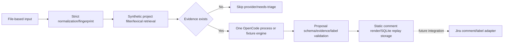

# Execution design and contracts

## Current boundary



The current CLI is not an HTTP/webhook server or internet ingress. Input
files are supplied by the caller, and real webhook signatures, principal, and
Jira issue security are not checked. Equality comparison on `project` is a
synthetic trusted-filter boundary that prevents cross-project fixture leaks.
Production ACL must be re-implemented before search/model calls, using a
trusted server principal and a real ACL adapter.

## Local RAG proof-of-concept boundary

The `rag/` package and `python3 -m rag index|query|eval` commands are a local
proof of concept for the proposed retrieval design; they are **not adopted
production architecture** and do not change the nexus runtime above. The
default path is Python 3.9+ standard library plus SQLite, synthetic fixtures,
and deterministic local stand-ins. It performs no network calls, does not
accept Jira ingress, and does not publish Jira changes.

The local RAG implementation makes these bounded decisions explicit:

- `eval` validates a non-empty golden set, unique non-blank relevant IDs,
  unique variants and cutoffs, corpus membership and document-type filters,
  and duplicate/unknown returned IDs. It requests at least the evaluation
  depth (`max(10, *cutoffs)`) from the retrieval seam, so MRR@10 and nDCG@10
  are measured against a real top-10 result rather than a serving top-5
  truncation.
- `ContextBuilder` orders canonical evidence before supporting evidence,
  links resolution text only to selected problem issue keys, deduplicates
  repeated hits, and never exceeds `max_chars` including an omission notice.
- `index` stages both the authoritative JSON state and an optional disposable
  SQLite sidecar before replacing either destination. Query reconstructs its
  temporary registry from embedded JSON, and evaluation/query close only
  registries they own; shared lexical/vector indexes are not closed as a side
  effect.

These controls are local correctness and safety checks, not evidence of
production ACL enforcement, real-provider quality, OpenSearch/PostgreSQL
integration, or adoption. Adoption remains gated by the real, sanitized
golden-set and ACL-leakage evidence in [RAG_DESIGN.md](RAG_DESIGN.md).

## Decisions

### Static code owns the flow

Python owns input schema, Unicode/whitespace normalization, fingerprinting,
project filtering, lexical scoring, the evidence count limit, proposal
validation, comment rendering, and SQLite replay. OpenCode only performs
semantic symptom interpretation and action-sentence suggestion after evidence
has already been selected. The LLM is never given Jira tools, search
permission, or write permission, and never executes instructions found in
search body text.

### Local replay identity

The `event_proposals` row key in SQLite is `event_id` alone. On first
processing, the event JSON object accepted at the boundary is serialized as
canonical JSON (sorted keys, compact separators, UTF-8) and its SHA-256
fingerprint is stored alongside it.

- Same `event_id` and same fingerprint: return the stored proposal and skip
  the engine.
- Same `event_id` and different fingerprint: fail as a payload conflict,
  without overwriting or auto-updating the existing result.
- The fingerprint covers only the event payload, so a corpus change does not
  change replay identity. Intentional reprocessing is expressed with a new
  event ID/version policy.

SQLite's `BEGIN IMMEDIATE` serializes concurrent producers for the same
event. A producer failure rolls back the transaction, leaving it in a
retryable state. This local mechanism does not guarantee exactly-once
delivery for external Jira side effects.

### Evidence and corpus semantics

Search returns at most 5 evidence items, and in the synthetic fixture, only
documents with the same project remain before scoring. Lexical scoring uses
title hits, text hits, the resolved hint, and document ID ordering. The
corpus `text` field must record the source-derived actual remediation and
outcome. `resolved: true` is only a priority/fixture-selection hint, not proof
of factual accuracy, remediation content, or outcome. That an evidence ID
exists and shares a lexical token is a structural link and a weak grounding
check — not proof that a recommendation is factually accurate.

## Proposal output contract (v2, audience-split)

**Implemented 2026-09-10** (design recorded then implemented same day),
following the product decision on
[GitHub issue #9](https://github.com/hjung3113/jira-voc-nexus/issues/9):
dual-audience output — a user-ready reply and a separate internal
engineering pointer — is in MVP scope. This is the current, running
contract: it replaced the single undifferentiated `recommendations` list
as a hard cutover (no v1 code path remains in `nexus/proposals.py`). See
"Implementation record" below for exactly what changed and where.

The object an engine returns, and the validator must pass, allows exactly
these three fields:

```json
{
  "customer_reply": {"text": "string", "evidence_ids": ["known-id"]},
  "engineering_action": {"text": "string", "evidence_ids": ["known-id"]},
  "labels": ["possible-duplicate", "severity:medium"]
}
```

Either audience field may be `null` instead of an object when no grounded
content exists for that audience — the engine must never invent a reply or
action to fill a field, the same insufficient-evidence-means-hold rule as
v1's empty `recommendations` list.

The exact allowlist and limits:

- The only top-level keys are `customer_reply`, `engineering_action`, and
  `labels`. All three keys must be present; either audience field's value
  must be `null` or an object.
- When present, an audience object has only `text` and `evidence_ids`.
  `text` must be a string, non-empty after NFKC/whitespace normalization,
  and at most 2,000 characters — the same bound as v1's per-item limit.
- `evidence_ids` is 1 to 5 unique strings, referencing only IDs already
  present in the ACL-filtered retrieval result. `customer_reply` and
  `engineering_action` are grounded **independently**: each field's text
  tokens must overlap with at least one title/text token of its own cited
  source set. A source cited by one audience field does not ground the
  other.
- `labels` is a list of unique raw strings. `needs-triage` and
  `possible-duplicate` retain their v1 meanings and may co-occur; at most one
  of `severity:low`, `severity:medium`, `severity:high`, or
  `severity:critical` may be present. `audience-coverage:*` is never accepted
  from the engine/model — code computes that value from the two audience
  fields and adds it only to the public/rendered surfaces. Unknown or
  duplicate labels fail closed.
- When there is no evidence, the engine is not called, and
  `{"customer_reply": null, "engineering_action": null, "labels":
  ["needs-triage"]}` is produced — unchanged in spirit from v1.

A model result that fails this schema fails outright. A grounded field and
its structural evidence link are a safeguard for human review, not a
guarantee of factual accuracy, for either audience.

### Why two single objects, not two lists

v1 allowed up to 5 `recommendations` items with no audience distinction.
This design intentionally narrows each audience to at most one grounded
statement rather than porting the list shape twice (which would double the
worst-case size and blur "the one thing to tell the customer" against "the
one thing engineering should do"). If real usage shows a single audience
needs multiple distinct evidence-grounded points, widening one field back to
a bounded list is a compatible follow-up (additive to this record, not a
breaking change to the other field).

### Implementation record

The following code changes implement this contract (landed 2026-09-10):

- `nexus/proposals.py`: `validate_proposal` (new schema, independent
  per-field grounding via `_audience_field`), `fixture_proposal` (produces
  both fields, still fixture/demo-only), `render_comment`/`render_issue`
  (v2 templates, see [docs/TEMPLATES.md](TEMPLATES.md)).
- `nexus/opencode.py`'s `_request_message`: `output_contract` and
  `instructions` describe the `customer_reply`/`engineering_action` shape,
  instruct the model to return `null` rather than invent content when
  ungrounded, and instruct it to ground each audience field only in the
  sources it cites for that field — this also closes the "OpenCode prompt
  carries no audience/label policy" gap recorded in
  [docs/GAP_ANALYSIS.md](GAP_ANALYSIS.md).
- `nexus/service.py`'s public result: `recommendations` replaced by
  `customer_reply` and `engineering_action` (see "Public result and
  operational status" below).
- Regression tests in `tests/test_nexus.py`: both-null (needs-triage) path,
  customer-only grounded, engineering-only grounded, both grounded with
  disjoint evidence sets, and both directions of cross-field citation
  (a field citing a source that only grounds the other field) rejected by
  `validate_proposal`.
- Verification: `python3 -m unittest discover -s tests` — 181/181 passing
  (3 PG-registry tests skip, unrelated to this change); `git diff --check`
  clean; fixture CLI smoke run against `fixtures/event.json` +
  `fixtures/corpus.json` succeeded and its exact output is reflected in
  [docs/TEMPLATES.md](TEMPLATES.md)'s v2 real-example blocks.

## Recipient routing (implemented, GitHub issue #8)

**Implemented 2026-09-11.** [GitHub issue
#8](https://github.com/hjung3113/jira-voc-nexus/issues/8) is that no field
anywhere says who should receive a recommended action — no user-support vs.
dev-team split. This section records the implemented deterministic signal and
its boundaries.

**Recipients are a pure, deterministic function of which audience fields the
already-validated proposal carries — never a model output.** This follows the
project's own boundary rule (mechanically decidable behavior belongs in
Python, not in the LLM's judgment): whether `customer_reply` or
`engineering_action` is grounded is already a fact the validator has
established: `customer_reply` present → `user-support` is a recipient;
`engineering_action` present → `dev-team` is a recipient; both present → both;
both `null` → no recipient. In the current fixture/no-evidence path both
fields being `null` is always paired with `labels: ["needs-triage"]`, but
`validate_proposal` does not enforce that pairing as an invariant — it only
allowlists label values, independently of the audience fields' nullness (see
[docs/TEMPLATES.md](TEMPLATES.md)'s label-taxonomy section, which documents
the same non-invariant for `possible-duplicate`). A real engine could in
principle return both fields `null` with a different allowed label; the
statement above describes intended behavior, not a validated guarantee.

```text
recipients(proposal) -> List[str]  # subset of ["user-support", "dev-team"], in that fixed order
```

This is not an engine-contract change. `validate_proposal`'s schema stays
exactly `{customer_reply, engineering_action, labels}` — no fourth key, no
schema field, and the model is never asked to decide or emit a recipient.
`recipients` is computed once, from the already-validated proposal, by a
single function shared by the public result and both renderers, so the three
call sites cannot disagree about who an event was routed to.

### Where it surfaces

- **Public result** (`nexus/service.py`): a new `recipients` key, a list of 0
  to 2 strings drawn only from `{"user-support", "dev-team"}`, in that fixed
  order when both are present. Additive to the six-day-old v2 public result
  key set (`comment`, `customer_reply`, `demo_only`, `dry_run`, `engine`,
  `engineering_action`, `event_id`, `issue`, `issue_key`, `labels`,
  `published`, `state`) — no existing key is removed or renamed.
- **`render_comment`/`render_issue`**: one new `Recipients: <comma+space
  joined, or "none">` line, placed after `Labels:` and before the marker line
  in both formats. This is an additive widening of the v2 template, not a new
  format version (no `v3` marker). Its own rationale (not the "Why two
  single objects, not two lists" precedent above, which is about widening one
  audience field to a bounded list, not about marker versioning): no real
  Jira/write consumer exists yet (`published` is always `false`, as already
  stated for the v1→v2 cutover itself in "Public result and operational
  status" below), so there is nothing whose parsing a new line could break.
  The marker line itself, and its position as the last line, are unchanged.

### What this does *not* do

This closes only the "no signal exists" half of issue #8. It does not wire
`recipients` to an actual Jira assignee, component, or queue field — that
mapping (which user-support queue, which dev-team component) requires a
real Jira ACL/adapter connection and belongs to
[docs/INTEGRATION.md](INTEGRATION.md)'s Jira comment/label adapter
completion conditions, not this local scaffold. `recipients` is the
deterministic input a future write adapter would consume; it does not itself
address, assign, or notify anyone.

### Implementation

- `nexus/proposals.py`: `recipients(proposal: Mapping[str, Any]) ->
  List[str]` sits next to `_audience_lines`/`_cited_fields` and drives the new
  `Recipients:` line in both `render_comment` and `render_issue`.
- `nexus/service.py`: the public `recipients` result key is computed from the
  validated proposal with the same `nexus.proposals.recipients` function.
- `tests/test_nexus.py`: four recipient cases — both-null → `[]`/`"none"`,
  customer-only → `["user-support"]`, engineering-only → `["dev-team"]`,
  both → `["user-support", "dev-team"]` in that order — are covered at the
  `recipients()` unit level, rendered output level, and public result level.
- [docs/TEMPLATES.md](TEMPLATES.md): the `Recipients:` line is present in
  both v2 format descriptions and real-example blocks (comment and issue).
- [docs/INTEGRATION.md](INTEGRATION.md): already notes `recipients` as the
  future input to a real Jira assignee/component/queue mapping, and its
  "Proposal/model contract" section was already corrected from the stale v1
  `recommendations` shape to the actual v2 shape — both done as part of this
  same design-record change, not a remaining follow-up.

## Label taxonomy dimensions (implemented, GitHub issue #4)

**Implemented 2026-09-11.** [GitHub issue
#4](https://github.com/hjung3113/jira-voc-nexus/issues/4) originally recorded
that `ALLOWED_LABELS` had only `{needs-triage, possible-duplicate}` — one
dimension, with no severity/component/root-cause/fix-type signal anywhere.
This section records the two additive dimensions implemented from that design
without a breaking input-contract change; component, root-cause, and fix-type
remain explicitly deferred below.

### Decision: severity/component/root-cause values are in-runtime inferred, not producer-supplied

The user decided (2026-09-11) that new taxonomy dimensions are populated by
OpenCode's semantic judgment over retrieved evidence, not by extending the
`Event`/corpus input contract. This keeps the v1/v2 event schema exactly as
strict as it is today (`event_id/issue_key/project/summary/description/labels`,
unknown fields rejected — [docs/TEMPLATES.md](TEMPLATES.md) §3) and avoids the
breaking producer-contract change and versioning decision that issue #5
requires. The trade-off, accepted knowingly: values depend on model judgment
over evidence text, not a structured field a producer already tracked, so
they inherit the same "safeguard for human review, not a factual guarantee"
status as `customer_reply`/`engineering_action` text.

This decision resolves the "producer-supplied vs. in-runtime" open question
recorded in `docs/GAP_ANALYSIS.md` for the label-taxonomy half only —
issue #3 (severity/impact/priority *scoring* used by retrieval/ranking) and
issue #5 (input contract fields) are separate slices and remain undecided.

### Decision: audience coverage is a computed dimension, not an LLM-judged label

The "asymmetric audience-grounding" open question in
[docs/TEMPLATES.md](TEMPLATES.md) §5 — what happens when only one of
`customer_reply`/`engineering_action` is grounded — is resolved the same way
recipient routing (issue #8) was resolved: as a pure function of the already-
validated proposal, computed once in `nexus/proposals.py` and shared by both
renderers and the public result, never asked of the model. No third
`needs-triage`/`possible-duplicate` label is added; instead a new orthogonal
`audience-coverage` dimension carries exactly one of:

- `audience-coverage:customer-only` — `customer_reply` grounded, `engineering_action` null
- `audience-coverage:engineering-only` — `engineering_action` grounded, `customer_reply` null
- `audience-coverage:both` — both grounded
- `audience-coverage:neither` — both null (always paired with `needs-triage`)

`needs-triage`/`possible-duplicate` keep their current meaning and
co-occurrence rules unchanged (see [docs/TEMPLATES.md](TEMPLATES.md) §5); the
new dimension is additive, not a replacement.

### Decision: severity is a bounded, omittable LLM-judged label

A new `severity` dimension, values `severity:low`, `severity:medium`,
`severity:high`, `severity:critical`. OpenCode's prompt instructs it to
select at most one `severity:*` value only when the cited evidence text
itself indicates a severity signal (data loss, outage, no workaround,
security impact → high/critical; a documented workaround or cosmetic issue →
low/medium), and to omit the dimension entirely — never guess a value — when
the evidence gives no signal, the same null-not-invented doctrine already
governing `customer_reply`/`engineering_action`. `validate_proposal` enforces
this structurally: at most one `severity:*` value among `labels`, and only
the four listed values are allowlisted; it cannot and does not check that the
choice matches the evidence (semantic judgment stays a human-review
safeguard, per the existing proposal-validation boundary).

### Explicitly deferred, not designed here

- **`component`** — needs a known, bounded component/project enum to
  classify against. No such registry exists in `nexus/` or the `rag/`
  toolkit's `IndexDocument` (see [docs/RAG_DESIGN.md](RAG_DESIGN.md)); adding
  one is its own slice, not a label-format decision. Deferred until that
  registry question is answered.
- **`root-cause`** — depends on evidence-to-label linkage that issue #6
  ("no evidence-to-label linkage in the RAG toolkit") has not yet designed;
  inferring a root-cause category without that linkage would be an
  ungrounded guess, which the null-not-invented doctrine above forbids.
  Deferred until issue #6 is designed.
- **`fix-type`** — the original gap's intent (distinguishing "needs a code
  fix" from "needs a support reply") is already covered by the
  `audience-coverage` dimension above (`engineering-only` implies a fix is
  needed with no customer-facing reply produced; `customer-only` implies the
  opposite). No separate `fix-type` dimension is added to avoid two labels
  encoding the same signal.

### Implementation

- `nexus/proposals.py`: dimension-aware raw allowlisting adds the four
  `severity:*` values while preserving unrestricted co-occurrence of the two
  triage labels. `validate_proposal` rejects unknown/disallowed labels,
  including model-supplied `audience-coverage:*`, and rejects more than one
  severity value. `audience_coverage(proposal) -> str` computes the four
  coverage cases; both renderers add the prefixed computed value to the same
  sorted `Labels:` line as the raw labels. `fixture_proposal` remains a fixed
  demo heuristic and emits no severity judgment.
- `nexus/service.py`: the public result exposes the same
  `audience_coverage` value computed from the validated proposal.
- `nexus/opencode.py`: `_request_message` describes the four severity values,
  the evidence-signalled selection policy, omission when evidence gives no
  signal, and the prohibition on emitting `audience-coverage:*`; the existing
  audience/duplication judgment instructions remain intact.
- `tests/test_nexus.py`: raw-label cardinality/disallowlist cases, single
  severity acceptance, all four public-result coverage cases, and computed
  coverage in both rendered formats are covered.
- [docs/TEMPLATES.md](TEMPLATES.md) §5 documents both implemented dimensions;
  its current v2 examples reflect the fixture CLI's computed label output.

## Severity/impact/priority scoring (design, GitHub issue #3)

[GitHub issue #3](https://github.com/hjung3113/jira-voc-nexus/issues/3)
originally named one gap that is actually two separate concerns once
separated by what each score orders:

1. **Evidence-ranking score** — `nexus/retrieval.py`'s `retrieve()` computes
   a lexical-overlap score per candidate document purely to rank and cut
   evidence to the top `MAX_EVIDENCE` documents for one event. This is
   already scoring, already used, and intentionally internal: it ranks
   *documents against one event's text*, not events against each other, and
   exposing it in the public result would misrepresent an unweighted lexical
   heuristic as a calibrated confidence number. No change: it stays an
   implementation detail of `retrieve()`, matching the existing
   `resolved: true` "hint, not proof" treatment recorded above.
2. **Business severity/impact for triage prioritization** — the issue's
   actual "impact" complaint ("a triage queue cannot order work, route by
   SLA, or decide escalation") — is a *different* score: a per-event
   judgment about how urgent the underlying problem is.

### Decision: business severity is the already-implemented `severity:*` label, not a new numeric field

Concern 2 is the same "producer-supplied vs. in-runtime vs. human-edited"
question `docs/GAP_ANALYSIS.md` recorded for issue #3, and the label
taxonomy section above already answered it for severity: **in-runtime
inferred**, not producer-supplied (`docs/ARCHITECTURE.md`'s "severity/
component/root-cause values are in-runtime inferred" decision, explicitly
noted there as resolving the label-taxonomy half only, with #3 left open).
This section closes that gap: the four-value `severity:low|medium|high|
critical` label implemented for issue #4 **is** the business severity signal
issue #3 asked for — evidence-signalled, omittable, LLM-judged, surfaced in
both the public result's `labels` key and the rendered `Labels:` line. No
second, separately-computed numeric priority field is added; one severity
signal per event, not two that could disagree.

This keeps the `Event` input contract exactly as strict as today
(`event_id/issue_key/project/summary/description/labels`, unknown fields
rejected) — no breaking change, no dependency on issue #5's versioning
decision, consistent with how #4 was resolved.

### Explicitly deferred, not designed here: ordering, SLA routing, escalation

`severity:*` being present on one proposal does not give this scaffold a way
to *use* it across events — there is no queue, scheduler, or batch runner
anywhere in `nexus/`; the CLI processes exactly one file-supplied event per
invocation (`docs/PROJECT_OVERVIEW.md`'s scaffold boundary). Ordering a
triage queue, routing by SLA, or triggering automatic escalation all require
a real queue/adapter that receives multiple events and a Jira priority-field
mapping, neither of which this design adds — building a local queue or
scheduler now would be pre-building infrastructure ahead of the real
integration slice, which this project's rules forbid. `docs/GAP_ANALYSIS.md`
already tracks the two related open questions this leaves genuinely
unresolved (not this design's job to answer): "routing model" (static
label→queue/component/assignee config vs. a data-driven ownership registry)
and "escalation trigger semantics" (which label/evidence combination creates
the `[VOC]` issue vs. a comment only, and what priority mapping applies).
Recorded as future work in [docs/INTEGRATION.md](INTEGRATION.md) rather than
implemented here.

### Implementation

None — this is a design-only resolution. No code changed: `severity:*`
already exists (issue #4), and the evidence-ranking score already stays
internal by design. The only follow-up is documentation (this section plus
the [docs/INTEGRATION.md](INTEGRATION.md) future-work note).

## Input contract versioning (design, GitHub issue #5)

[GitHub issue #5](https://github.com/hjung3113/jira-voc-nexus/issues/5)
worried that the strict, exact-field-set `Event`/corpus contracts
(`docs/TEMPLATES.md` §3–4) have no place to carry component, severity, or
root-cause data, and that adding such fields later would be a breaking
change for a producer already shipping against v1.

### Decision: no Event/corpus contract change — the premise no longer holds

Every dimension issue #5 named has since been designed as **in-runtime
inferred, not producer-supplied**:

- **severity** — resolved by issue #4's `severity:*` label and reaffirmed by
  issue #3's decision above: an LLM judgment over evidence text, never a
  producer field.
- **root-cause** — issue #4 deferred this pending evidence-to-label linkage;
  the "Evidence-to-label linkage" section below designs that linkage as an
  addition to the `rag/` evidence side (`IndexDocument`), not the `Event`
  input contract.
- **component** — issue #4 deferred this pending a bounded component/project
  registry to classify against. That registry, if and when it's built, is a
  *evidence-side* data question (which components appear in known corpus
  documents — `IndexDocument.component` already carries this per-document,
  unvalidated against any enum), not something a producer needs to supply on
  the incoming `Event`.

Since nothing identified so far needs a new `Event`/corpus field, the
breaking-change risk issue #5 raised does not materialize: `Event` stays
exactly `event_id/issue_key/project/summary/description/labels`, and the
corpus document contract stays exactly `id/project/title/text/resolved/url`,
both unchanged, both still strict/fail-closed on unknown fields (per
`nexus/models.py`).

This is **not** a claim that the input contract can never change — if a
future, not-yet-identified need requires a producer-supplied field (for
example, a real SLA/ownership field a producer's own system already tracks
and nexus has no way to infer), that need still requires its own explicit
versioning decision (additive optional field vs. a hard v2 cutover, and what
a v2 replay does with v1-shaped stored events, mirroring how the v1→v2
*output* marker cutover was handled) at the time it's identified — not
designed speculatively now, per this project's "no pre-building outside the
current MVP" rule.

### Implementation

None — this is a design-only resolution declining a contract change, not a
code change. `nexus/models.py`'s `Event`/`Document` and
`docs/TEMPLATES.md` §3–4 are unchanged.

## Evidence-to-label linkage (design, GitHub issue #6)

[GitHub issue #6](https://github.com/hjung3113/jira-voc-nexus/issues/6)
found that source-issue labels are ingested into `NormalizedIssue.metadata`
(`guides/RAG_JIRA_INGESTION.md`'s `fields.labels` → `metadata.labels`
mapping) but dropped at `issue_to_documents` projection — `IndexDocument`
has no `labels` field at all — so nothing ties a label choice to the
evidence that's supposed to justify it, unlike `customer_reply`/
`engineering_action` text, which `validate_proposal` already grounds against
cited evidence lexically.

This gap has two independent halves with different implementability today:

### Decision (a): add `IndexDocument.labels`, implementable now

Add `labels: Tuple[str, ...]` to `rag/contracts.py`'s `IndexDocument`,
following the exact pattern already used for `entity_ids` (`_string_tuple`
parsing, empty tuple where a source has no label concept). `issue_to_documents`
sources it from `issue.metadata.get("labels", [])`, the same way `component`/
`system` are already read from `metadata`. `wiki_to_document` sets
`labels=()` — a `WikiPage` has no label concept, the same precedent
`project=""` established for issue #7. This is a pure projection-correctness
fix inside the not-yet-adopted `rag/` POC toolkit: it does not touch
`nexus/`, does not wire `rag/` into the nexus runtime, and does not require
passing the evaluation gate — it fixes data that is already being computed
and silently discarded, exactly like issue #7's `project` field fix. Safe to
implement in its own slice without waiting on issue #10.

### Decision (b): grounding labels against evidence in `nexus/proposals.py` is deferred to issue #10

The other half of the gap — `validate_proposal` actually checking a chosen
label against cited evidence's labels, the way it already checks
`customer_reply`/`engineering_action` text — needs `nexus/` to receive
evidence that carries a `labels` field at all. Today it does not:
`NexusService.process` retrieves evidence only through
`nexus.retrieval.retrieve`, which returns `nexus.models.Document` (the
CLI's own fixture corpus contract, decided above to stay unchanged), never
`rag.contracts.IndexDocument`. Wiring `nexus/` to consume `rag/` evidence at
all is issue #10, explicitly excluded from this design session (blocked by
`docs/RAG_DESIGN.md`'s no-pre-eval-gate-adoption non-goal). Grounding labels
against evidence is therefore deferred to whenever #10 is designed and
implemented — recorded here so that work is not re-discovered from scratch.

### Implementation

Not yet implemented. Decision (a) (`rag/contracts.py`'s `IndexDocument.labels`
field, `issue_to_documents`/`wiki_to_document` wiring, a
`guides/RAG_JIRA_INGESTION.md` note that `metadata.labels` now reaches the
index document, and `tests/test_rag_*.py` coverage) is ready to implement as
its own slice, independent of #10. Decision (b) (`nexus/proposals.py`
grounding) has no implementation path until #10 lands.

## OpenCode boundary

For each new event with evidence, the adapter runs exactly one OpenCode
process of the following shape, within a bounded budget. A process's JSON
stream may contain auxiliary events/titles, so this is never interpreted as a
contract of "exactly one provider HTTP request."

```text
opencode run --pure --format json --model <provider/model> --agent voc-triage
```

The request passes the event, the already-selected and capped evidence, and
the output contract above over stdin. The adapter uses a temporary working
directory and a deny-all permission configuration, but this is not an OS/
network sandbox. Error, timeout, malformed, and truncated results in the
returned stream, and schema failures, are all treated as hold/fail. No public
provider fallback, unbounded retry, or automatic escalation to a costlier
model is performed.

The production configuration is `NEXUS_OPENCODE_MODEL=provider/model`, a
`NEXUS_APPROVED_PROVIDER` whose prefix matches it, and
`NEXUS_OPENCODE_CONFIG` pointing to a runtime JSON file holding the selected
provider block. The adapter leaves only the one approved provider,
`enabled_providers: [provider]`, `small_model: model`, `share: disabled`,
deny-all permission for both the global and `voc-triage` agent, and a short
agent prompt that ignores untrusted event/evidence in the temporary config.
The child process is given `OPENCODE_CONFIG` and `OPENCODE_CONFIG_CONTENT`
pointing at the temporary file/content, and project/default/skill/model-
fetch/share are disabled. Credentials are injected by the deployment
environment and never put in the repository. Real endpoint verification for
provider containment happens at the time of the provider connection. Semantic
rerank is never split into a separate model call or process.

## Public result and operational status

The current public CLI result provides `comment`, `customer_reply`,
`demo_only`, `dry_run`, `engine`, `engineering_action`, `event_id`, `issue`,
`issue_key`, `labels`, `published`, `recipients`, `state`. `customer_reply` and
`engineering_action` replaced the earlier `recommendations` key as of the
2026-09-10 audience-split cutover — a breaking change to the CLI's public
JSON shape, acceptable because `published` is always `false` and no real
Jira consumer exists yet.

The `comment` key is a string rendered with comment format v2 (see
[docs/TEMPLATES.md](TEMPLATES.md)); the `issue` key is an issue format v2
object with exactly the `summary`, `description`, `marker` keys. Both
formats end with a final marker line — `voc-nexus-comment|v2|<event_id>` or
`voc-nexus-issue|v2|<event_id>` — and the same `event_id` always produces
the same marker. A comment/issue produced before this cutover under format
v1 (`voc-nexus-comment|v1|<event_id>` / `voc-nexus-issue|v1|<event_id>`)
keeps its stored v1 result on replay — replay identity is `event_id` +
payload fingerprint, not renderer version; see `HANDOFF.md`'s replay
caveat. `published` is always false, and `dry_run` is always true. The
current local-only `state` value is `prepared`, which does not mean a
successful Jira publish. A real Jira comment/label adapter must have its own
separate lifecycle and reconciliation contract.

The current implementation does not include a Jira comment/label adapter.
`atlassian-python-api==5.0.4` is only a future candidate to reconsider once
real ACL/auth/server flavor is secured. A real Jira comment/label adapter is
a separate vertical slice. The operation marker, post-timeout reconciliation,
partial-success labeling, DB ownership, and 429/5xx bounded-retry contracts
are implemented after the [operational integration contract](INTEGRATION.md)
is satisfied.
