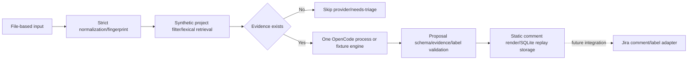

# Execution design and contracts

## Current boundary



The current CLI is not an HTTP/webhook server or internet ingress. Input
files are supplied by the caller, and real webhook signatures, principal, and
Jira issue security are not checked. Equality comparison on `project` is a
synthetic trusted-filter boundary that prevents cross-project fixture leaks.
Production ACL must be re-implemented before search/model calls, using a
trusted server principal and a real ACL adapter.

## Local RAG proof-of-concept boundary

The `rag/` package and `python3 -m rag index|query|eval` commands are a local
proof of concept for the proposed retrieval design; they are **not adopted
production architecture** and do not change the nexus runtime above. The
default path is Python 3.9+ standard library plus SQLite, synthetic fixtures,
and deterministic local stand-ins. It performs no network calls, does not
accept Jira ingress, and does not publish Jira changes.

The local RAG implementation makes these bounded decisions explicit:

- `eval` validates a non-empty golden set, unique non-blank relevant IDs,
  unique variants and cutoffs, corpus membership and document-type filters,
  and duplicate/unknown returned IDs. It requests at least the evaluation
  depth (`max(10, *cutoffs)`) from the retrieval seam, so MRR@10 and nDCG@10
  are measured against a real top-10 result rather than a serving top-5
  truncation.
- `ContextBuilder` orders canonical evidence before supporting evidence,
  links resolution text only to selected problem issue keys, deduplicates
  repeated hits, and never exceeds `max_chars` including an omission notice.
- `index` stages both the authoritative JSON state and an optional disposable
  SQLite sidecar before replacing either destination. Query reconstructs its
  temporary registry from embedded JSON, and evaluation/query close only
  registries they own; shared lexical/vector indexes are not closed as a side
  effect.

These controls are local correctness and safety checks, not evidence of
production ACL enforcement, real-provider quality, OpenSearch/PostgreSQL
integration, or adoption. Adoption remains gated by the real, sanitized
golden-set and ACL-leakage evidence in [RAG_DESIGN.md](RAG_DESIGN.md).

## Decisions

### Static code owns the flow

Python owns input schema, Unicode/whitespace normalization, fingerprinting,
project filtering, lexical scoring, the evidence count limit, proposal
validation, comment rendering, and SQLite replay. OpenCode only performs
semantic symptom interpretation and action-sentence suggestion after evidence
has already been selected. The LLM is never given Jira tools, search
permission, or write permission, and never executes instructions found in
search body text.

### Local replay identity

The `event_proposals` row key in SQLite is `event_id` alone. On first
processing, the event JSON object accepted at the boundary is serialized as
canonical JSON (sorted keys, compact separators, UTF-8) and its SHA-256
fingerprint is stored alongside it.

- Same `event_id` and same fingerprint: return the stored proposal and skip
  the engine.
- Same `event_id` and different fingerprint: fail as a payload conflict,
  without overwriting or auto-updating the existing result.
- The fingerprint covers only the event payload, so a corpus change does not
  change replay identity. Intentional reprocessing is expressed with a new
  event ID/version policy.

SQLite's `BEGIN IMMEDIATE` serializes concurrent producers for the same
event. A producer failure rolls back the transaction, leaving it in a
retryable state. This local mechanism does not guarantee exactly-once
delivery for external Jira side effects.

### Evidence and corpus semantics

Search returns at most 5 evidence items, and in the synthetic fixture, only
documents with the same project remain before scoring. Lexical scoring uses
title hits, text hits, the resolved hint, and document ID ordering. The
corpus `text` field must record the source-derived actual remediation and
outcome. `resolved: true` is only a priority/fixture-selection hint, not proof
of factual accuracy, remediation content, or outcome. That an evidence ID
exists and shares a lexical token is a structural link and a weak grounding
check — not proof that a recommendation is factually accurate.

## Proposal output contract (v2, audience-split)

**Implemented 2026-09-10** (design recorded then implemented same day),
following the product decision on
[GitHub issue #9](https://github.com/hjung3113/jira-voc-nexus/issues/9):
dual-audience output — a user-ready reply and a separate internal
engineering pointer — is in MVP scope. This is the current, running
contract: it replaced the single undifferentiated `recommendations` list
as a hard cutover (no v1 code path remains in `nexus/proposals.py`). See
"Implementation record" below for exactly what changed and where.

The object an engine returns, and the validator must pass, allows exactly
these three fields:

```json
{
  "customer_reply": {"text": "string", "evidence_ids": ["known-id"]},
  "engineering_action": {"text": "string", "evidence_ids": ["known-id"]},
  "labels": ["possible-duplicate"]
}
```

Either audience field may be `null` instead of an object when no grounded
content exists for that audience — the engine must never invent a reply or
action to fill a field, the same insufficient-evidence-means-hold rule as
v1's empty `recommendations` list.

The exact allowlist and limits:

- The only top-level keys are `customer_reply`, `engineering_action`, and
  `labels`. All three keys must be present; either audience field's value
  must be `null` or an object.
- When present, an audience object has only `text` and `evidence_ids`.
  `text` must be a string, non-empty after NFKC/whitespace normalization,
  and at most 2,000 characters — the same bound as v1's per-item limit.
- `evidence_ids` is 1 to 5 unique strings, referencing only IDs already
  present in the ACL-filtered retrieval result. `customer_reply` and
  `engineering_action` are grounded **independently**: each field's text
  tokens must overlap with at least one title/text token of its own cited
  source set. A source cited by one audience field does not ground the
  other.
- `labels` is a list of unique strings; the only allowed values are
  `needs-triage` and `possible-duplicate` — unchanged from v1. Whether a
  third label dimension (e.g. distinguishing "engineering action only, no
  customer reply produced") is needed is an open question for the
  companion taxonomy slice (GitHub issue #5), not decided here.
- When there is no evidence, the engine is not called, and
  `{"customer_reply": null, "engineering_action": null, "labels":
  ["needs-triage"]}` is produced — unchanged in spirit from v1.

A model result that fails this schema fails outright. A grounded field and
its structural evidence link are a safeguard for human review, not a
guarantee of factual accuracy, for either audience.

### Why two single objects, not two lists

v1 allowed up to 5 `recommendations` items with no audience distinction.
This design intentionally narrows each audience to at most one grounded
statement rather than porting the list shape twice (which would double the
worst-case size and blur "the one thing to tell the customer" against "the
one thing engineering should do"). If real usage shows a single audience
needs multiple distinct evidence-grounded points, widening one field back to
a bounded list is a compatible follow-up (additive to this record, not a
breaking change to the other field).

### Implementation record

The following code changes implement this contract (landed 2026-09-10):

- `nexus/proposals.py`: `validate_proposal` (new schema, independent
  per-field grounding via `_audience_field`), `fixture_proposal` (produces
  both fields, still fixture/demo-only), `render_comment`/`render_issue`
  (v2 templates, see [docs/TEMPLATES.md](TEMPLATES.md)).
- `nexus/opencode.py`'s `_request_message`: `output_contract` and
  `instructions` describe the `customer_reply`/`engineering_action` shape,
  instruct the model to return `null` rather than invent content when
  ungrounded, and instruct it to ground each audience field only in the
  sources it cites for that field — this also closes the "OpenCode prompt
  carries no audience/label policy" gap recorded in
  [docs/GAP_ANALYSIS.md](GAP_ANALYSIS.md).
- `nexus/service.py`'s public result: `recommendations` replaced by
  `customer_reply` and `engineering_action` (see "Public result and
  operational status" below).
- Regression tests in `tests/test_nexus.py`: both-null (needs-triage) path,
  customer-only grounded, engineering-only grounded, both grounded with
  disjoint evidence sets, and both directions of cross-field citation
  (a field citing a source that only grounds the other field) rejected by
  `validate_proposal`.
- Verification: `python3 -m unittest discover -s tests` — 181/181 passing
  (3 PG-registry tests skip, unrelated to this change); `git diff --check`
  clean; fixture CLI smoke run against `fixtures/event.json` +
  `fixtures/corpus.json` succeeded and its exact output is reflected in
  [docs/TEMPLATES.md](TEMPLATES.md)'s v2 real-example blocks.

## Recipient routing (design, GitHub issue #8)

**Design recorded 2026-09-11, not yet implemented.** [GitHub issue
#8](https://github.com/hjung3113/jira-voc-nexus/issues/8) is that no field
anywhere says who should receive a recommended action — no user-support vs.
dev-team split. This section is the design; "Implementation follow-up" below
lists what a future slice must change.

**Recipients are a pure, deterministic function of which audience fields the
already-validated proposal carries — never a model output.** This follows the
project's own boundary rule (mechanically decidable behavior belongs in
Python, not in the LLM's judgment): whether `customer_reply` or
`engineering_action` is grounded is already a fact the validator has
established: `customer_reply` present → `user-support` is a recipient;
`engineering_action` present → `dev-team` is a recipient; both present → both;
both `null` → no recipient (the `needs-triage` label alone still says a human
must look at it, unrouted).

```text
recipients(proposal) -> List[str]  # subset of ["user-support", "dev-team"], in that fixed order
```

This is not an engine-contract change. `validate_proposal`'s schema stays
exactly `{customer_reply, engineering_action, labels}` — no fourth key, no
schema field, and the model is never asked to decide or emit a recipient.
`recipients` is computed once, from the already-validated proposal, by a
single function shared by the public result and both renderers, so the three
call sites cannot disagree about who an event was routed to.

### Where it surfaces

- **Public result** (`nexus/service.py`): a new `recipients` key, a list of 0
  to 2 strings drawn only from `{"user-support", "dev-team"}`, in that fixed
  order when both are present. Additive to the six-day-old v2 public result
  key set (`comment`, `customer_reply`, `demo_only`, `dry_run`, `engine`,
  `engineering_action`, `event_id`, `issue`, `issue_key`, `labels`,
  `published`, `state`) — no existing key is removed or renamed.
- **`render_comment`/`render_issue`**: one new `Recipients: <comma+space
  joined, or "none">` line, placed after `Labels:` and before the marker line
  in both formats. This is an additive widening of the v2 template, not a new
  format version (no `v3` marker) — the same reasoning already used for v1→v2
  widening candidates in "Why two single objects, not two lists" above: no
  real Jira/write consumer exists yet (`published` is always `false`), so
  there is nothing whose parsing this could break. The marker line itself,
  and its position as the last line, are unchanged.

### What this does *not* do

This closes only the "no signal exists" half of issue #8. It does not wire
`recipients` to an actual Jira assignee, component, or queue field — that
mapping (which user-support queue, which dev-team component) requires a
real Jira ACL/adapter connection and belongs to
[docs/INTEGRATION.md](INTEGRATION.md)'s Jira comment/label adapter
completion conditions, not this local scaffold. `recipients` is the
deterministic input a future write adapter would consume; it does not itself
address, assign, or notify anyone.

### Implementation follow-up (not done in this design session)

- `nexus/proposals.py`: add `def recipients(proposal: Mapping[str, Any]) ->
  List[str]` next to `_audience_lines`/`_cited_fields`; use it from both
  `render_comment` and `render_issue` for the new `Recipients:` line.
- `nexus/service.py`: add the `recipients` public result key, computed via
  the same `nexus.proposals.recipients` function on the validated proposal.
- `tests/test_nexus.py`: four cases — both-null → `[]`/`"none"`,
  customer-only → `["user-support"]`, engineering-only → `["dev-team"]`,
  both → `["user-support", "dev-team"]` in that order — checked at both the
  `recipients()` unit level and against the rendered `Recipients:` line in
  `render_comment`/`render_issue`, plus one assertion that `nexus/service.py`
  results carry a `recipients` key consistent with `customer_reply`/
  `engineering_action` nullness.
- [docs/TEMPLATES.md](TEMPLATES.md): add the `Recipients:` line to both v2
  format descriptions and real-example blocks (comment and issue).
- [docs/INTEGRATION.md](INTEGRATION.md): note `recipients` as the future
  input to a real Jira assignee/component/queue mapping once that adapter
  exists; its own "Proposal/model contract" section is currently stale
  (still describes v1's single `recommendations` list) and should be
  corrected to the v2 shape in the same pass, since it is directly adjacent
  text this change edits.

## OpenCode boundary

For each new event with evidence, the adapter runs exactly one OpenCode
process of the following shape, within a bounded budget. A process's JSON
stream may contain auxiliary events/titles, so this is never interpreted as a
contract of "exactly one provider HTTP request."

```text
opencode run --pure --format json --model <provider/model> --agent voc-triage
```

The request passes the event, the already-selected and capped evidence, and
the output contract above over stdin. The adapter uses a temporary working
directory and a deny-all permission configuration, but this is not an OS/
network sandbox. Error, timeout, malformed, and truncated results in the
returned stream, and schema failures, are all treated as hold/fail. No public
provider fallback, unbounded retry, or automatic escalation to a costlier
model is performed.

The production configuration is `NEXUS_OPENCODE_MODEL=provider/model`, a
`NEXUS_APPROVED_PROVIDER` whose prefix matches it, and
`NEXUS_OPENCODE_CONFIG` pointing to a runtime JSON file holding the selected
provider block. The adapter leaves only the one approved provider,
`enabled_providers: [provider]`, `small_model: model`, `share: disabled`,
deny-all permission for both the global and `voc-triage` agent, and a short
agent prompt that ignores untrusted event/evidence in the temporary config.
The child process is given `OPENCODE_CONFIG` and `OPENCODE_CONFIG_CONTENT`
pointing at the temporary file/content, and project/default/skill/model-
fetch/share are disabled. Credentials are injected by the deployment
environment and never put in the repository. Real endpoint verification for
provider containment happens at the time of the provider connection. Semantic
rerank is never split into a separate model call or process.

## Public result and operational status

The current public CLI result provides `comment`, `customer_reply`,
`demo_only`, `dry_run`, `engine`, `engineering_action`, `event_id`, `issue`,
`issue_key`, `labels`, `published`, `state`. A `recipients` key is designed
(see "Recipient routing" above) but not yet implemented. `customer_reply` and
`engineering_action` replaced the earlier `recommendations` key as of the
2026-09-10 audience-split cutover — a breaking change to the CLI's public
JSON shape, acceptable because `published` is always `false` and no real
Jira consumer exists yet.

The `comment` key is a string rendered with comment format v2 (see
[docs/TEMPLATES.md](TEMPLATES.md)); the `issue` key is an issue format v2
object with exactly the `summary`, `description`, `marker` keys. Both
formats end with a final marker line — `voc-nexus-comment|v2|<event_id>` or
`voc-nexus-issue|v2|<event_id>` — and the same `event_id` always produces
the same marker. A comment/issue produced before this cutover under format
v1 (`voc-nexus-comment|v1|<event_id>` / `voc-nexus-issue|v1|<event_id>`)
keeps its stored v1 result on replay — replay identity is `event_id` +
payload fingerprint, not renderer version; see `HANDOFF.md`'s replay
caveat. `published` is always false, and `dry_run` is always true. The
current local-only `state` value is `prepared`, which does not mean a
successful Jira publish. A real Jira comment/label adapter must have its own
separate lifecycle and reconciliation contract.

The current implementation does not include a Jira comment/label adapter.
`atlassian-python-api==5.0.4` is only a future candidate to reconsider once
real ACL/auth/server flavor is secured. A real Jira comment/label adapter is
a separate vertical slice. The operation marker, post-timeout reconciliation,
partial-success labeling, DB ownership, and 429/5xx bounded-retry contracts
are implemented after the [operational integration contract](INTEGRATION.md)
is satisfied.
