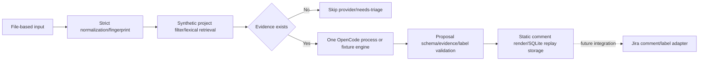

# Execution design and contracts

## Current boundary



The current CLI is not an HTTP/webhook server or internet ingress. Input
files are supplied by the caller, and real webhook signatures, principal, and
Jira issue security are not checked. Equality comparison on `project` is a
synthetic trusted-filter boundary that prevents cross-project fixture leaks.
Production ACL must be re-implemented before search/model calls, using a
trusted server principal and a real ACL adapter.

## Decisions

### Static code owns the flow

Python owns input schema, Unicode/whitespace normalization, fingerprinting,
project filtering, lexical scoring, the evidence count limit, proposal
validation, comment rendering, and SQLite replay. OpenCode only performs
semantic symptom interpretation and action-sentence suggestion after evidence
has already been selected. The LLM is never given Jira tools, search
permission, or write permission, and never executes instructions found in
search body text.

### Local replay identity

The `event_proposals` row key in SQLite is `event_id` alone. On first
processing, the event JSON object accepted at the boundary is serialized as
canonical JSON (sorted keys, compact separators, UTF-8) and its SHA-256
fingerprint is stored alongside it.

- Same `event_id` and same fingerprint: return the stored proposal and skip
  the engine.
- Same `event_id` and different fingerprint: fail as a payload conflict,
  without overwriting or auto-updating the existing result.
- The fingerprint covers only the event payload, so a corpus change does not
  change replay identity. Intentional reprocessing is expressed with a new
  event ID/version policy.

SQLite's `BEGIN IMMEDIATE` serializes concurrent producers for the same
event. A producer failure rolls back the transaction, leaving it in a
retryable state. This local mechanism does not guarantee exactly-once
delivery for external Jira side effects.

### Evidence and corpus semantics

Search returns at most 5 evidence items, and in the synthetic fixture, only
documents with the same project remain before scoring. Lexical scoring uses
title hits, text hits, the resolved hint, and document ID ordering. The
corpus `text` field must record the source-derived actual remediation and
outcome. `resolved: true` is only a priority/fixture-selection hint, not proof
of factual accuracy, remediation content, or outcome. That an evidence ID
exists and shares a lexical token is a structural link and a weak grounding
check — not proof that a recommendation is factually accurate.

## Proposal output contract

The object an engine returns, and the validator must pass, allows exactly
these two fields:

```json
{
  "recommendations": [
    {"text": "string", "evidence_ids": ["known-id"]}
  ],
  "labels": ["possible-duplicate"]
}
```

The exact allowlist and limits:

- The only top-level keys are `recommendations` and `labels`.
- `recommendations` is a list with at most 5 items. Each item has only
  `text` and `evidence_ids`.
- `text` must be a string, non-empty after NFKC/whitespace normalization, and
  at most 2,000 characters.
- `evidence_ids` is 1 to 5 unique strings, referencing only IDs already
  present in the ACL-filtered retrieval result. A recommendation's tokens
  must overlap with at least one title/text token of its cited source.
- `labels` is a list of unique strings; the only allowed values are
  `needs-triage` and `possible-duplicate`.
- When there is no evidence, the engine is not called, and `recommendations:
  []`, `labels: ["needs-triage"]` is produced.

A model result that fails this schema fails outright. The recommendation
text and structural evidence link are a safeguard for human review, not a
guarantee of factual accuracy.

## OpenCode boundary

For each new event with evidence, the adapter runs exactly one OpenCode
process of the following shape, within a bounded budget. A process's JSON
stream may contain auxiliary events/titles, so this is never interpreted as a
contract of "exactly one provider HTTP request."

```text
opencode run --pure --format json --model <provider/model> --agent voc-triage
```

The request passes the event, the already-selected and capped evidence, and
the output contract above over stdin. The adapter uses a temporary working
directory and a deny-all permission configuration, but this is not an OS/
network sandbox. Error, timeout, malformed, and truncated results in the
returned stream, and schema failures, are all treated as hold/fail. No public
provider fallback, unbounded retry, or automatic escalation to a costlier
model is performed.

The production configuration is `NEXUS_OPENCODE_MODEL=provider/model`, a
`NEXUS_APPROVED_PROVIDER` whose prefix matches it, and
`NEXUS_OPENCODE_CONFIG` pointing to a runtime JSON file holding the selected
provider block. The adapter leaves only the one approved provider,
`enabled_providers: [provider]`, `small_model: model`, `share: disabled`,
deny-all permission for both the global and `voc-triage` agent, and a short
agent prompt that ignores untrusted event/evidence in the temporary config.
The child process is given `OPENCODE_CONFIG` and `OPENCODE_CONFIG_CONTENT`
pointing at the temporary file/content, and project/default/skill/model-
fetch/share are disabled. Credentials are injected by the deployment
environment and never put in the repository. Real endpoint verification for
provider containment happens at the time of the provider connection. Semantic
rerank is never split into a separate model call or process.

## Public result and operational status

The current public CLI result provides `dry_run`, `published`, `engine`,
`demo_only`, `event_id`, `issue_key`, `comment`, `issue`, `labels`,
`recommendations`, `state`.

The `comment` key is a string rendered with comment format v1
(see [docs/TEMPLATES.md](TEMPLATES.md)); the `issue` key is an issue format v1
object with exactly the `summary`, `description`, `marker` keys. Both formats
end with a final marker line — `voc-nexus-comment|v1|<event_id>` or
`voc-nexus-issue|v1|<event_id>` — and the same `event_id` always produces the
same marker. `published` is always false, and `dry_run` is always true. The
current local-only `state` value is `prepared`, which does not mean a
successful Jira publish. A real Jira comment/label adapter must have its own
separate lifecycle and reconciliation contract.

The current implementation does not include a Jira comment/label adapter.
`atlassian-python-api==5.0.4` is only a future candidate to reconsider once
real ACL/auth/server flavor is secured. A real Jira comment/label adapter is
a separate vertical slice. The operation marker, post-timeout reconciliation,
partial-success labeling, DB ownership, and 429/5xx bounded-retry contracts
are implemented after the [operational integration contract](INTEGRATION.md)
is satisfied.
