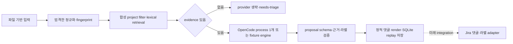

# 실행 설계와 계약

## 현재 경계



현재 CLI는 HTTP/webhook 서버나 인터넷 ingress가 아니다. 입력 파일은 호출자가
제공하며, 실제 webhook 서명·principal·Jira issue security를 검사하지 않는다.
`project` 동등 비교는 cross-project fixture 누출을 막는 합성 trusted-filter
경계다. production ACL은 검색/모델 호출 전에 신뢰된 서버 principal과 실제 ACL
어댑터로 다시 구현해야 한다.

## 결정

### 정적 코드가 흐름을 소유한다

입력 schema, Unicode/whitespace 정규화, fingerprint, project filter, lexical score,
evidence 수 제한, proposal 검증, 댓글 render, SQLite replay를 Python이 소유한다.
OpenCode는 evidence가 이미 선택된 뒤 의미적 증상 해석과 조치 문장 제안만 수행한다.
LLM은 Jira 도구·검색 권한·쓰기 권한을 받지 않으며, 검색 본문 속 지시문을 실행하지
않는다.

### 로컬 replay identity

SQLite의 `event_proposals` row key는 `event_id` 하나다. 최초 처리 시 boundary에서
받아들인 이벤트 JSON object를 canonical JSON(키 정렬, compact separators,
UTF-8)으로 직렬화해 SHA-256 fingerprint를 함께 저장한다.

- 같은 `event_id`와 같은 fingerprint: 저장한 proposal을 반환하고 engine을 생략한다.
- 같은 `event_id`와 다른 fingerprint: payload conflict로 실패하며 기존 결과를
  덮어쓰거나 자동 update하지 않는다.
- fingerprint는 이벤트 payload만 대상으로 하므로 corpus 변경은 replay identity를
  바꾸지 않는다. 의도적인 재처리는 새 event ID/version 정책으로 표현한다.

SQLite의 `BEGIN IMMEDIATE`는 같은 이벤트의 concurrent producer를 직렬화한다.
producer 실패는 transaction을 rollback해 재시도 가능한 상태로 남긴다. 이 로컬
mechanism은 Jira 외부 효과의 exactly-once를 보장하지 않는다.

### Evidence와 corpus 의미

검색은 최대 5개 evidence를 반환하고, 합성 fixture에서는 project가 같은 문서만
scoring 전에 남긴다. lexical score는 title hit, text hit, resolved hint와 문서 ID
정렬을 사용한다. corpus `text`에는 source-derived actual remediation과 outcome을
기록해야 한다. `resolved: true`는 우선순위/fixture 선택 힌트일 뿐 사실성·해결
내용·결과의 증명이 아니다. evidence ID가 존재하고 lexical token이 겹치는 것은
구조적 연결과 약한 grounding 검사이지 추천의 사실성 증명이 아니다.

## Proposal 출력 계약

engine이 반환하고 validator가 통과시켜야 하는 object는 다음 두 필드만 허용한다.

```json
{
  "recommendations": [
    {"text": "string", "evidence_ids": ["known-id"]}
  ],
  "labels": ["possible-duplicate"]
}
```

정확한 allowlist와 limits:

- top-level key는 `recommendations`, `labels`뿐이다.
- `recommendations`는 list이며 최대 5개다. 각 item은 `text`, `evidence_ids`만
  갖는다.
- `text`는 string이어야 하고 NFKC/whitespace 정규화 후 비어 있지 않으며 최대
  2,000자다.
- `evidence_ids`는 1~5개의 중복 없는 string이고, 이미 ACL-filtered retrieval
  result에 있는 ID만 참조한다. recommendation token은 인용한 source의 title/text
  token과 하나 이상 겹쳐야 한다.
- `labels`는 중복 없는 string list이며 허용값은 `needs-triage`와
  `possible-duplicate`뿐이다.
- evidence가 없으면 engine을 호출하지 않고 recommendations `[]`, labels
  `["needs-triage"]`를 만든다.

모델 결과는 이 schema를 통과하지 않으면 실패한다. 추천 문장과 구조적 evidence
연결은 사람 검토를 위한 안전장치이지 사실 정확성의 보증이 아니다.

## OpenCode 경계

evidence가 있는 새 이벤트마다 adapter가 제한된 예산으로 다음 성격의 OpenCode
process 하나를 수행한다. process의 JSON stream에 auxiliary event/title이 포함될 수
있으므로 이를 provider HTTP 요청 정확히 한 번이라는 계약으로 해석하지 않는다.

```text
opencode run --pure --format json --model <provider/model> --agent voc-triage
```

요청은 이벤트와 이미 선택·제한된 evidence, 위 output contract를 stdin으로 전달한다.
adapter는 임시 작업 디렉터리와 deny-all 권한 설정을 사용하지만 이것은 OS/network
sandbox가 아니다. 반환 stream의 error·timeout·malformed·truncated 결과와 schema
실패는 보류/실패로 처리한다. 공개 provider fallback, 무한 재시도, 자동 고비용
승격을 하지 않는다.

운영 설정은 `NEXUS_OPENCODE_MODEL=provider/model`, prefix가 일치하는
`NEXUS_APPROVED_PROVIDER`, 그리고 선택한 provider block을 담은 runtime JSON file을
가리키는 `NEXUS_OPENCODE_CONFIG`다. adapter는 임시 config에 승인 provider 하나,
`enabled_providers: [provider]`, `small_model: model`, `share: disabled`, global과
`voc-triage` agent의 deny-all permission, untrusted event/evidence를 무시하는 짧은
agent prompt만 남긴다. child에는 `OPENCODE_CONFIG`와 `OPENCODE_CONFIG_CONTENT`가
임시 파일/내용을 가리키도록 주입하고, project/default/skill/model-fetch/share를
비활성화한다. 자격 증명은 배포 환경에서 주입하며 저장소에 넣지 않는다. provider
containment의 실제 endpoint 검증은 provider 연결 시점에 수행한다. semantic rerank는
별도 모델 호출이나 process로 분리하지 않는다.

## Public result와 운영 상태

현재 public CLI result는 `dry_run`, `published`, `engine`, `demo_only`, `event_id`,
`issue_key`, `comment`, `labels`, `recommendations`, `state`를 제공한다. `published`는
항상 false이고 `dry_run`은 항상 true다. 현재 local-only `state` 값은 `prepared`이며,
Jira 게시 성공을 뜻하지 않는다. 실제 Jira 댓글·라벨 adapter는 별도 lifecycle과
reconciliation contract를 가져야 한다.

현재 Jira 댓글·라벨 adapter는 구현하지 않는다. `atlassian-python-api==5.0.4`는
실제 ACL/auth/server flavor가 확보될 때 검토할 향후 후보일 뿐이다. 실제 Jira
댓글·라벨 adapter는 별도 vertical slice다. operation marker, timeout 후
reconciliation, label partial success, DB ownership, 429/5xx bounded retry 계약을
[운영 연결 계약](INTEGRATION.md) 충족 뒤에 구현한다.
